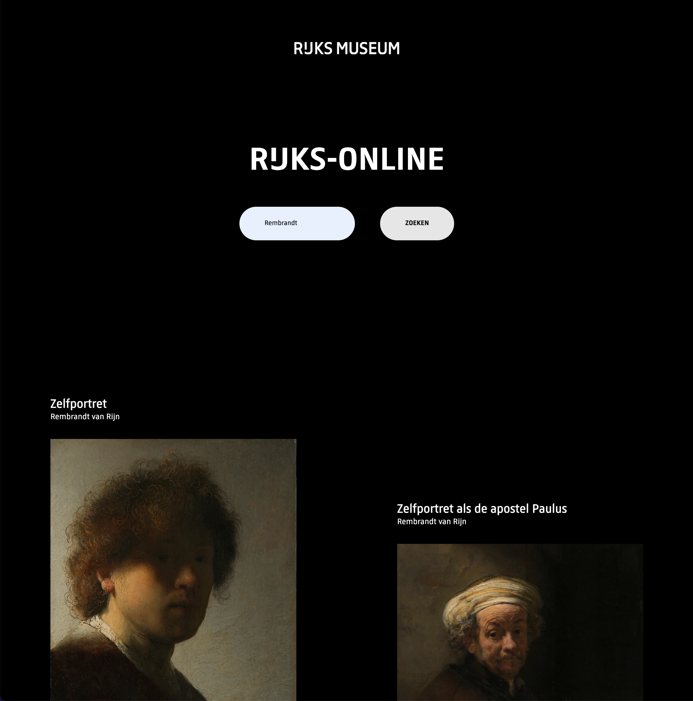

# Rijks-Online


Shields that represent my project - They change over time. (https://shields.io/)

## Description
Rijks-Online is a Single Page Application that let's the user search all of the extraordinary artworks from the Rijksmuseum. This is being done with the help of the Rijks-API. With this API it's possible to showcase all of the artworks that the Rijksmuseum offers. 




## Table of Contents

- [Install](#install)
- [Features](#features)
- [Used Tools](#used-tools)
- [Meta](#meta)
- [License](#license)

## Install

Clone the GitHub Repo locally

```
git clone https://github.com/DaanKetelaars/Rijks-Online
```

Connect your API Key.

- Go to the Rijks Studio.
- Create an account.
- Go to advanced settings and ask for your own personal API key.
- in the **fetchData.js** file, add your own API key. 
```
`https://www.rijksmuseum.nl/api/nl/collection?key=[APIKEYHERE]&q=${userInput}`
```

Host this project on live-server or localhost. 


- Download the live-server extension in Vscode.
- Call the live-server and the artworks will be shown.
- for more information: https://github.com/ritwickdey/vscode-live-server


## Used Tools

- [git](https://git-scm.com/)
- [json](https://www.json.org/json-en.html)
- [rijks-api](https://data.rijksmuseum.nl/object-metadata/api/)

## Meta
For any questions, don't hesitate to reach out!
Daan Ketelaars - daanketelaars@gmail.com - https://github.com/DaanKetelaars/Rijks-Online

## License

Usage is provided under the [MIT License](https://github.com/git/git-scm.com/blob/master/MIT-LICENSE.txt) MIT. See [LICENSE](https://github.com/DaanKetelaars/Rijks-Online/blob/master/LICENSE) for the full details.


